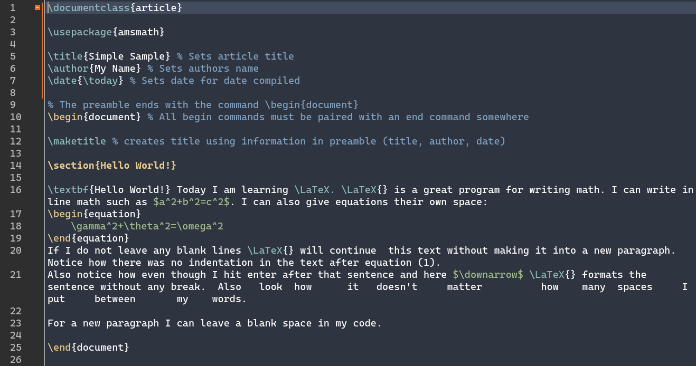

# A cozy Nord theme for Texmaker

The color palette is based on the awesome [Nord theme](https://www.nordtheme.com/).

To install the theme, replace the Color\ lines in `~/.config/xm1/texmaker.ini` with the ones provided in `texmaker_nord.ini` in this repository. 

